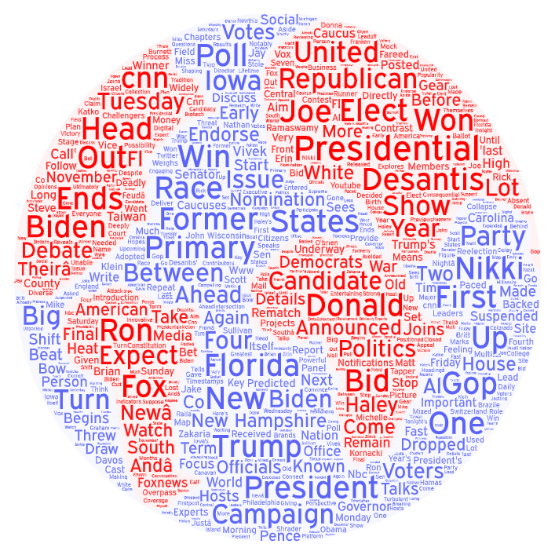
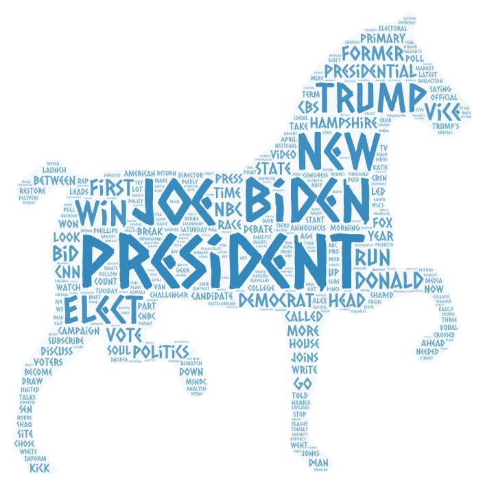
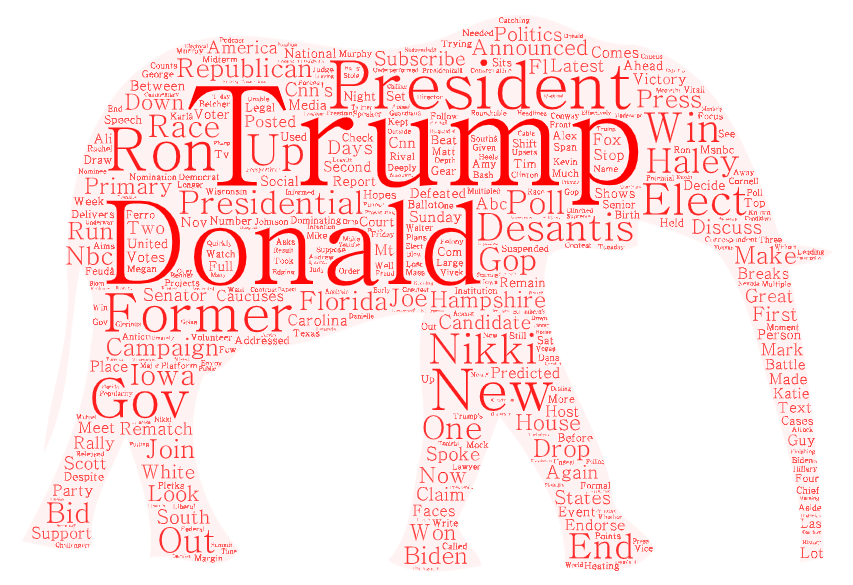

# Lab 2 
### Carter Burr

## Topic: Previewing the Presidential Election with a Youtube Web Crawler.
Search Parameters: 
1. "Presidential Election"
2. "Presidential Election" Trump"
3. "Presidential Election Biden"

For this project, I wanted to compare the YouTube search results for the different candidates in the upcoming Presidential election. I believe this is highly relevant as the election approaches, and it's essential to understand public sentiment towards both candidates. This is particularly pertinent now with the ongoing Republican primaries, providing insight into how the country perceives these candidates as the process unfolds.

To facilitate a meaningful comparison, I decided to analyze three datasets and generate word clouds for each one. One dataset serves as a control, while the other two represent Joe Biden and Donald Trump. I believed this approach would yield sufficient data and visual representations to discern any discrepancies in search results based on the candidates' names.

## First Search and Word Cloud

This is our control word cloud, where the search terms were limited to "Presidential Election." Upon examining these words, we observe many expected terms associated with the topic. Both 'Donald' and 'Trump' appear, as do 'Joe' and 'Biden', indicating a relatively balanced representation of both candidates. Additionally, there are numerous generic election-related terms such as Campaign, GOP, Primary, Race, Presidential, and Poll. Surprisingly, the word cloud lacks strongly opinionated terms. Most words seem neutral, focusing on factual aspects of the election or generic terms like locations. This serves as a good neutral control that we can compare to both of the canidates results.

## Second Search and Word Cloud

This word cloud features the search terms "Presidential Election Biden". The resulting words closely resemble those in our control word cloud, with expected terms like 'Joe', 'Biden', and 'President'. It's somewhat surprising to find 'Trump' as a prominent result, as one might expect the focus to be primarily on Joe Biden. Similar to the control, there's a notable absence of opinion-based words, with the search results primarily comprising common election terms and references to news websites or locations.

## Third Search and Word Cloud

This final word cloud was generated using the search terms "Presidential Election Trump." While it shares many similarities with the previous two, there are some distinctions. The results seem to emphasize the Republican primaries more, with mentions of 'Nikki' and 'Hailey' alongside 'Ron' and 'DeSantis'. This emphasis aligns with the current focus on the Republican Party primaries, reflecting recent news and events. Surprisingly, the word cloud lacks opinion words, despite the expectation of varied opinions about Donald Trump. Instead, it primarily features general election terms and locations, akin to the previous queries.

## Analysis

Upon reviewing all three word clouds, the results are somewhat surprising. Despite incorporating the names of different presidential candidates, the search terms predominantly yielded common election-related terms, with minimal distinction between them. I expected more opinionated words, either praising or criticizing the candidates. Additionally, all three word clouds featured names, locations, or generic political terms. The main discernible difference was the Trump search's focus on the Republican primary, whereas the Biden and control searches had a broader focus on the upcoming election. In hindsight, this outcome was foreseeable, given the ongoing primary and its influence on recent search results.

## Possible Future Improvements

One potential improvement for this project would be to conduct the analysis closer to the actual Presidential election. This timing might mitigate the disproportionate impact of the Republican primaries on the results, providing a clearer picture of public sentiment solely regarding the Presidential race. Additionally, refining the search parameters to compare only "Joe Biden" and "Donald Trump" results could potentially yield more of the opinion-based words sought for comparison purposes. One other possible future improvement of this project would be to focus on a more refined location instead of just a broad overview of the country. This would allow us to see more specific results based on the location, and most likley find the opinions that location has on both canidates. 

Dataset links:

[Control "Presidential Election" Dataset](assets/presidential-election.csv)

["Presidential Election Trump" Dataset](assets/presidential-election-trump.csv)

["Presidential Election Biden" Dataset](assets/presidential-election-biden.csv)
